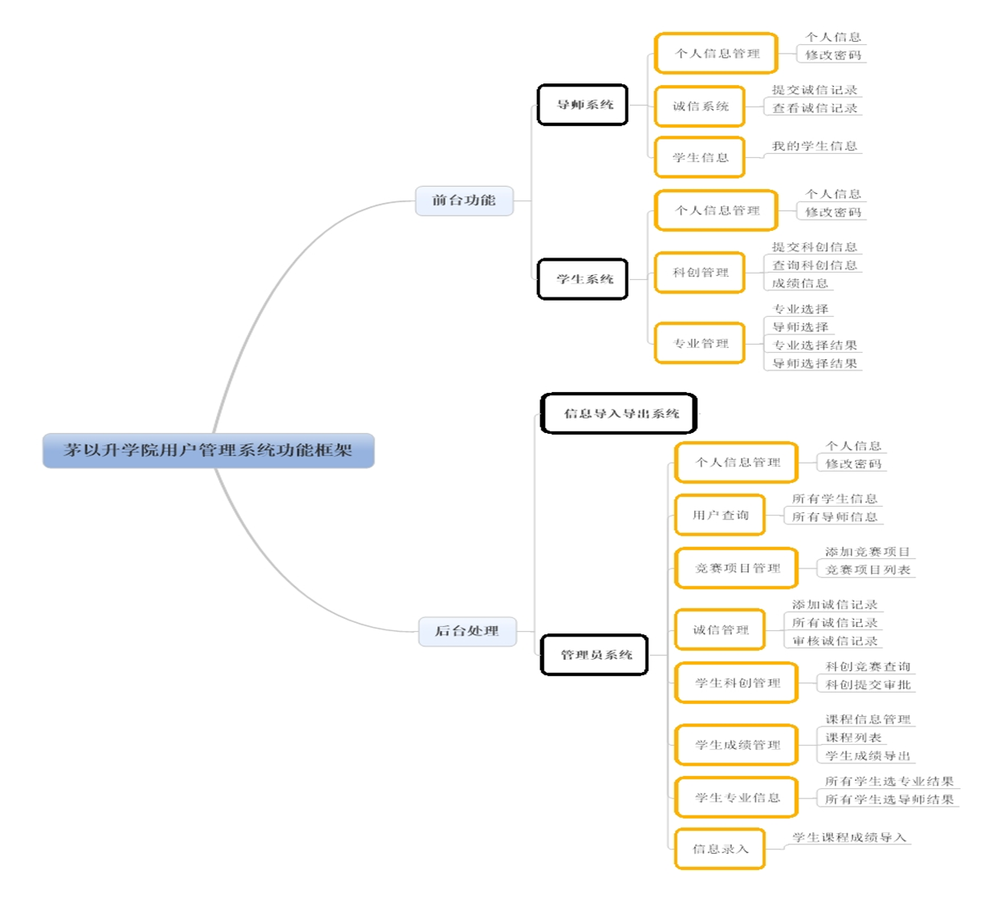
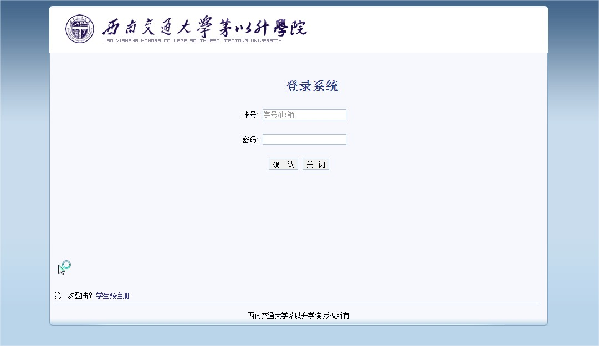
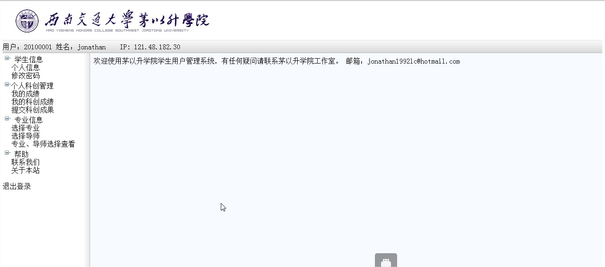
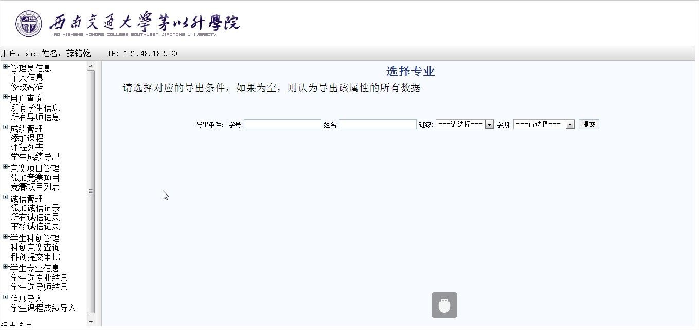

# 学生管理系统网站 #

## 功能 ##
本课题实现了茅以升学院学生管理的系统，通过struts2 web框架搭建了一个网站，主要完成对学生个人信息管理，课程成绩管理，科创信息管理，诚信记录管理，专业选择及导师选择的管理等功能。 

### 基本架构图 ###

### 效果截图 ###

 

## 使用 ##
1. 建立数据库，运行SQL/cratesql.sql
2. 把网站源码放入Tomcat7中
3. 使用ExportTool/Tool.jar导入相关学生，导师数据

## License ##
The licenses for most software are designed to take away your
freedom to share and change it.  By contrast, the GNU General Public
License is intended to guarantee your freedom to share and change free
software--to make sure the software is free for all its users.  This
General Public License applies to most of the Free Software
Foundation's software and to any other program whose authors commit to
using it.  (Some other Free Software Foundation software is covered by
the GNU Lesser General Public License instead.)  You can apply it to
your programs, too.

